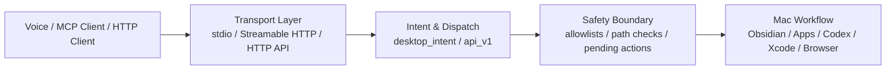

# Xiaozhi Desktop MCP

把小智、MCP Client 和本机 Mac 工作流连接起来的安全桌面工具层。

`xiaozhi-desktop-mcp` 是一个运行在本机的 MCP Server。它把 Obsidian 记忆、App 控制、Claude Code / Codex 会话、Xcode、浏览器、Finder、剪贴板等桌面能力封装成可控工具，让语音助手或 AI Client 能安全地调用本机能力。

它不是新的小智后端，也不是任意 shell 执行器。这个项目的核心是：用 MCP / HTTP 接口暴露能力，同时用白名单、路径限制、待确认动作、鉴权和可观测日志把桌面自动化收进安全边界。

[API](docs/api.md) · [Client Examples](docs/clients.md) · [Operations](docs/operations.md) · [Security](docs/security.md) · [Xiaozhi Integration](docs/xiaozhi-integration.md)

License: MIT · Version: 2.1.0 · Python · FastMCP · FastAPI

---

## What It Does



典型场景：

- “小智，记一下...” -> 写入 Obsidian vault
- “打开这个项目的 Claude Code” -> 在允许项目里启动可见会话
- “让 cc 检查 README” -> 创建或发送受控任务
- “打开 Xcode 并构建” -> 只操作白名单项目
- “搜索 Obsidian / 打开浏览器 / 控制音乐 / 读写剪贴板” -> 通过统一桌面意图执行

---

## Why This Exists

语音助手和 LLM 真正接入桌面时，难点不是“能不能调用命令”，而是“能不能安全、稳定、可追踪地调用本机能力”。

这个项目把桌面自动化里的风险收束成明确规则：

- App、项目、Xcode、Obsidian 都有白名单或路径边界
- 中风险动作先进入 pending action，再由用户确认
- MCP Client 可以走标准协议，普通程序可以走 HTTP API
- 每次请求都有 request id，方便从客户端追到工具调用
- HTTP 暴露到非 localhost 时必须开启 token 鉴权

---

## Transports

| 入口 | 命令 | 默认地址 | 适合场景 |
| --- | --- | --- | --- |
| MCP stdio | `xiaozhi-desktop-mcp` | 标准输入输出 | Claude Desktop、小智 bridge、本机 MCP client |
| MCP Streamable HTTP | `xiaozhi-desktop-mcp-streamable` | `http://127.0.0.1:8766/mcp` | 支持 MCP over HTTP 的客户端 |
| HTTP API | `xiaozhi-desktop-http` | `http://127.0.0.1:8765/api/v1` | Java / Python / Go / 普通后端服务 |

如果你接的是标准 MCP Client，优先使用 `stdio` 或 `Streamable HTTP`。

如果你只是从普通程序里调用桌面能力，使用 `/api/v1/dispatch`。

---

## Capabilities

| 能力 | 说明 |
| --- | --- |
| Obsidian | 保存记忆、创建/打开/追加笔记、每日笔记、搜索、最近记忆 |
| Claude Code / Codex | 打开项目、发送指令、slash 命令、切模型、状态查询、继续、聚焦、停止 |
| Project Alias | 从 `CC_ALLOWED_PROJECTS` 生成安全项目别名 |
| Apps | 打开、关闭、聚焦或查询 `ALLOWED_APPS` 白名单内的 macOS App |
| Xcode | 打开项目、build、test、clean、查看最近错误 |
| Browser / Finder / Clipboard | 浏览器打开搜索、Finder 定位、剪贴板读写 |
| Music | 播放、暂停、下一首、网易云音乐搜索等语音友好控制 |
| Pending Actions | 中风险动作先入队，确认后执行 |
| Diagnostics | 健康检查、配置摘要、工具目录、会话清理 |
| Observability | `X-Request-Id`、请求日志、工具调用耗时、错误追踪 |

---

## Quick Start

```bash
git clone git@github.com:jijiutong/xiaozhi-desktop-mcp.git
cd xiaozhi-desktop-mcp

python3 -m venv .venv
. .venv/bin/activate
pip install -e .

cp .env.example .env
```

编辑 `.env`，至少确认这些配置：

```env
OBSIDIAN_VAULT=/path/to/your/obsidian-vault
DESKTOP_MCP_CONFIG=desktop-mcp.yaml

DEFAULT_PROJECT_ROOT=/path/to/your/project
CC_ALLOWED_PROJECTS=/path/to/your/project
XCODE_ALLOWED_PROJECTS=/path/to/your/project

ALLOWED_APPS=Obsidian,Xcode,Google Chrome,Safari,Music,Finder,Terminal
```

启动普通 HTTP API：

```bash
xiaozhi-desktop-http
```

检查服务：

```bash
curl http://127.0.0.1:8765/api/v1/health
curl http://127.0.0.1:8765/api/v1/actions
```

启动标准 MCP Streamable HTTP：

```bash
xiaozhi-desktop-mcp-streamable
```

默认 endpoint：

```text
http://127.0.0.1:8766/mcp
```

---

## HTTP Dispatch

普通客户端推荐统一调用：

```text
POST /api/v1/dispatch
```

请求示例：

```json
{
  "request_id": "client-001",
  "action": "desktop_intent",
  "params": {
    "category": "docs",
    "intent": "search",
    "params": {
      "query": "desktop mcp"
    }
  }
}
```

响应示例：

```json
{
  "success": true,
  "request_id": "client-001",
  "action": "desktop_intent",
  "spoken_message": "找到了 3 条相关笔记。",
  "error_spoken_message": "",
  "error": "",
  "data": {}
}
```

客户端建议：

- 成功时读 `spoken_message`
- 失败时读 `error_spoken_message`
- 调试和结构化数据读 `data`
- 日志串联使用 `request_id`

更多 Java / Python / Go 示例见 [Client Examples](docs/clients.md)。

---

## Common Actions

| 任务 | Action |
| --- | --- |
| 通用桌面意图 | `desktop_intent` |
| 查看分类能力 | `category_registry` |
| 保存一条记忆 | `remember` |
| 搜索 Obsidian | `search_obsidian` |
| 新建 / 打开 / 追加笔记 | `create_note` / `open_note` / `append_daily_note` |
| 列出允许项目 | `list_projects` |
| 按项目名交给 Claude Code | `ask_cc_project` |
| 查看 Claude Code 状态 | `check_cc` |
| 让 Claude Code 继续 / 停止 | `continue_cc` / `stop_cc` |
| 发送 slash 命令 / 切模型 | `cc_send_slash_command` / `cc_switch_model` |
| 打开 / 关闭 App | `app_open` / `app_close` |
| 聚焦 / 查询 App | `app_focus` / `app_status` |
| 浏览器打开 / 搜索 | `browser_open` / `browser_search` |
| 音乐控制 / 搜索 | `music_control` / `music_search` |
| Xcode 构建 / 测试 / 清理 | `xcode_build` / `xcode_test` / `xcode_clean` |
| 查看 Xcode 最近错误 | `xcode_last_errors` |
| 创建 / 确认待执行动作 | `pending_create` / `pending_confirm` |
| 桌面环境自检 | `health` |
| 查看工具目录 | `tool_catalog` |

---

## Voice Examples

```text
小智，记一下：这个项目先做成桌面 MCP。
小智，打开这个项目的 Claude Code。
小智，把这个任务交给 cc：检查 README 是否清楚。
小智，让 cc 执行 /status。
小智，看看 cc 现在卡在哪。
小智，搜索 Obsidian 里关于桌面 MCP 的笔记。
小智，打开 Xcode 项目并构建。
小智，音乐下一首。
小智，用浏览器搜索 desktop mcp。
小智，把这段话复制到剪贴板。
```

---

## Security Model

| 边界 | 策略 |
| --- | --- |
| 任意 shell | 不提供 |
| App | 只能操作 `ALLOWED_APPS` |
| 项目 | 只能进入 `CC_ALLOWED_PROJECTS` |
| Xcode | 只能操作 `XCODE_ALLOWED_PROJECTS` |
| Obsidian | 只能访问 `OBSIDIAN_VAULT` |
| Finder | 只能打开 Obsidian、任务目录、允许项目内路径 |
| 中风险动作 | 先创建 pending action，确认后执行 |
| HTTP 鉴权 | 非 localhost 绑定必须设置 `DESKTOP_MCP_AUTH_TOKEN` |
| 可观测性 | 请求和工具调用记录 request id、状态、耗时，不打印 token |

HTTP API 和 Streamable HTTP 都支持：

```text
Authorization: Bearer <token>
X-Desktop-Mcp-Token: <token>
```

更多细节见 [Security Model](docs/security.md)。

---

## Project Structure

| 路径 | 作用 |
| --- | --- |
| `src/xiaozhi_desktop_mcp/server.py` | 标准 MCP stdio / Streamable HTTP 工具入口 |
| `src/xiaozhi_desktop_mcp/http_server.py` | FastAPI HTTP 服务 |
| `src/xiaozhi_desktop_mcp/api_v1.py` | 多语言统一 dispatch API |
| `src/xiaozhi_desktop_mcp/tools/` | Obsidian、App、cc、项目、Xcode、pending actions 等工具 |
| `desktop-mcp.yaml` | 通用桌面 category registry 配置 |
| `docs/api.md` | HTTP API 协议 |
| `docs/clients.md` | Java / Python / Go 示例 |
| `docs/operations.md` | 启动、检查和排障 |
| `docs/security.md` | 安全模型 |

---

## Development

```bash
. .venv/bin/activate
pytest
ruff check src tests
```

---

## Documentation

| 文档 | 内容 |
| --- | --- |
| [API](docs/api.md) | HTTP API 协议、鉴权、请求响应 |
| [Client Examples](docs/clients.md) | Java / Python / Go 接入示例 |
| [Operations](docs/operations.md) | 启动、健康检查、常见排障 |
| [Security](docs/security.md) | 白名单、路径限制、鉴权和日志 |
| [Xiaozhi Integration](docs/xiaozhi-integration.md) | 小智服务和 MCP bridge 接入 |
| [Changelog](CHANGELOG.md) | 版本变化 |

## License

MIT
